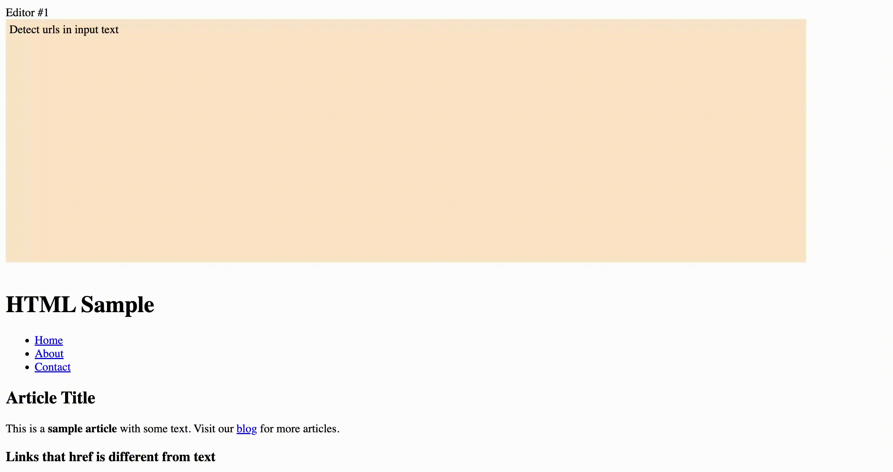
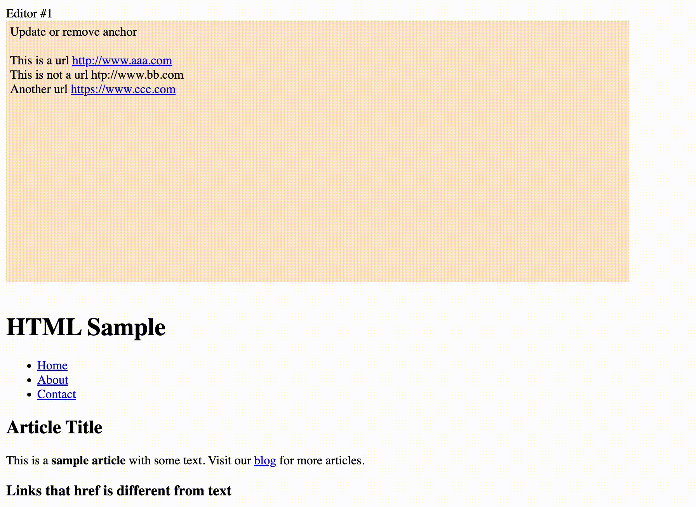
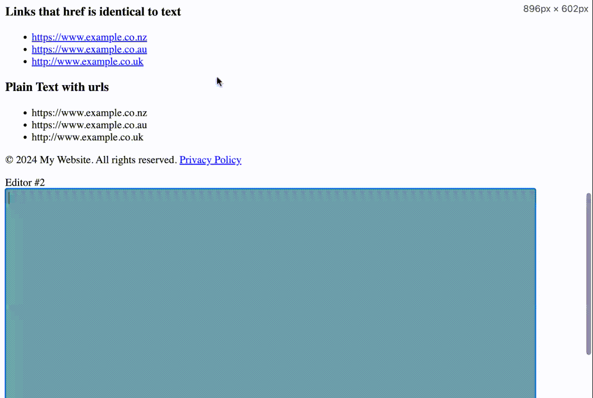

# AutoLink Editor


## Table of Contents
* [Introduction](#introduction)
* [Features](#features)
* [Usage](#usage)
* [Demo](#demo)
* [Reference](#reference)
* [Release Notes](#releasenotes)

## <a name="introduction">Introduction</a>
AutolinkEditor is a lightweight and simple text editor inspired by a specific requirement in a project. It automatically converts rich text pasted into the editor into plain text with the format of editor, and also automatically detects URLs in both pasted and manually entered text, converting them into anchor tags.

## <a name="usage">Usage</a>

### Include via CDN

To include the library via CDN, add the following script tag in your HTML:

```
<script src="https://cdn.jsdelivr.net/gh/oninebx/AutolinkEditor/dist/autolink-editor.min.js"></script>
```
### Initialize div as editor
Set an id for the div, and use the following code to initialize it as an autolink editor. Of course, you can initialize multiple editors as well.

```
<div id="editor-1"></div>
<div id="editor-2"></div> 
<script defer>   
    AutoLinkEditor.init("editor-1");
    AutoLinkEditor.init("editor-2");
</script>
```

## <a name="demo">Demo</a>

### Detect urls in input text


### Update or remove anchor


### Convert rich text into plain text with anchors


## <a name="features">Features</a>

* **Rich Text Conversion:** Automatically converts rich text pasted into the editor to a simple, clean format based on the editor's default style.
* **URL Detection in Pasted Text:** Automatically identifies URLs within pasted content and transforms them into clickable anchor `(<a>)` tags.
* **URL Detection in Input Text:** As the user types, URLs are detected in real-time and converted into anchor tags.
* **Update or remove anchor:** When the user modifies the text within an anchor tag, it will detect in real-time whether the anchor text is a URL and automatically update the anchor's href attribute, or convert the anchor tag into plain text.

> <mark>**What I'm looking for**</mark>
> > A robust regular expression of URL 

# <a name="reference">Reference</a>
[How to auto convert an url into a hyperlink when it is pasted](https://stackoverflow.com/questions/24162684/how-to-auto-convert-an-url-into-a-hyperlink-when-it-is-pasted?noredirect=1&lq=1)

# <a name="releasenotes">Release Notes</a>

## Release Note v1.0.0
This release introduces a lightweight text editor with automatic link detection and rich text handling, built to streamline user experiences when pasting and editing content.

### Key Features

1. **Rich Text Conversion**

	Automatically converts pasted rich text into the default formatting of the editor. This simplifies pasted content, ensuring consistency in the editor.

2. **Automatic URL Detection in Pasted Text**

	Detects URLs within pasted text and converts them into clickable anchor tags `(<a>)`. No need for manual link insertion.
	
3. **Real-time URL Detection in Typed Text**

	As users type URLs directly into the editor, they are instantly transformed into clickable anchor tags.

4. **Dynamic Anchor Update**

	When editing existing anchor tags, the editor detects changes and updates the anchor’s href attribute if the text is still a valid URL. If not, the anchor tag is automatically converted back into plain text.
	
-----

## Release Note v1.0.1
Fixed the issue of not supporting line breaks.

-----

## Release Note v1.0.2
Fix the issue where the line break format cannot be preserved.

-----